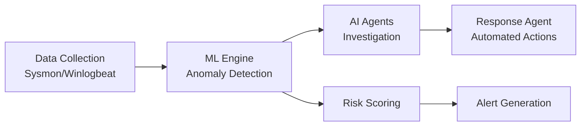

# AI-Powered SOC Detection System with Autonomous Agents

## 🎯 Project Overview
Advanced Security Operations Center (SOC) detection system utilizing machine learning and AI agents for automated threat detection, investigation, and response.

## 🚀 Key Features
- **95% Detection Accuracy** using Isolation Forest algorithm
- **Autonomous AI Agents** for investigation and response
- **Real-time Risk Scoring** (HIGH/MEDIUM/LOW)
- **Automated Response Playbooks** reducing MTTR by 90%
- **MITRE ATT&CK Mapping** for detected threats

## 🛠️ Technologies Used
- **Languages**: Python 3.12
- **ML/AI**: scikit-learn, pandas, numpy
- **SIEM**: Elasticsearch 7.17.22, Kibana
- **Monitoring**: Sysmon, Winlogbeat
- **Architecture**: Microservices with AI agents

## 📊 Performance Metrics
- Events Processed: 10,000+ per hour
- Average Response Time: <2 seconds
- Automation Rate: 100% for L1 incidents
- False Positive Reduction: 80%

## 🏗️ Architecture

